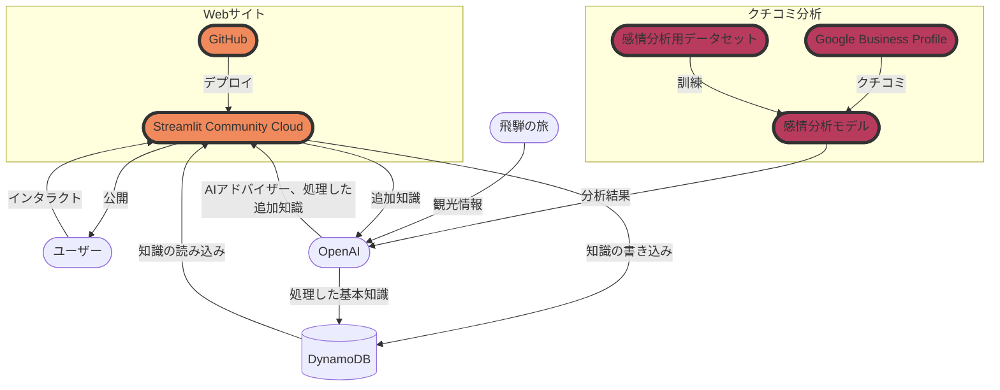

```mermaid
flowchart TB;
    style 2 fill:#f08a5d,stroke:#333,stroke-width:4px;
    style 3 fill:#f08a5d,stroke:#333,stroke-width:4px;
    style 5 fill:#b83b5e,stroke:#333,stroke-width:4px;
    style 6 fill:#b83b5e,stroke:#333,stroke-width:4px;
    style 8 fill:#b83b5e,stroke:#333,stroke-width:4px;
    subgraph Webサイト;
        2([GitHub]) -->|デプロイ| 3([Streamlit Community Cloud]);
    end;
    3 -->|公開| 4([ユーザー]);
    4 -->|インタラクト| 3;
    subgraph クチコミ分析;
        5([Google Business Profile]) -->|クチコミ| 6([感情分析モデル]);
        8([感情分析用データセット]) --> |訓練| 6;
    end;
    6 --> |分析結果| 7([OpenAI]);
    9([飛騨の旅]) --> |観光情報| 7;
    3 --> |知識の書き込み| 10[(DynamoDB)];
    10 --> |知識の読み込み| 3;
    3 --> |追加知識| 7;
    7 --> |AIアドバイザー、処理した追加知識| 3;
    7 --> |処理した基本知識| 10;
```
